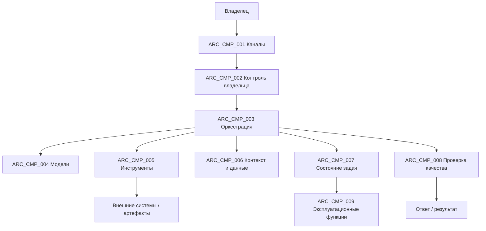

# Базовая логическая архитектура personal_ai_platform

## 1. Назначение

Документ отвечает на вопрос: **из каких устойчивых логических частей состоит система, за что каждая отвечает и как между ними проходит взаимодействие**.

Он не определяет план этапов, состав версии, физическую облачную топологию или конкретную среду агента и поставщика. Выбранный механизм фиксируется в ADR только после фактического выбора.

## 2. Архитектурные принципы

1. Контроль владельца и обязательные технические проверки находятся вне доверенной области модели и сменной среды агента.
2. Данные и решения принадлежат владельцу. Платформа технически управляет каноническим состоянием от его имени. Состояние не принадлежит конкретной модели, программной основе или поставщику.
3. Внешние зависимости подключаются через ограниченные адаптерные границы.
4. Навык описывает повторяемый многошаговый сценарий. Возможность — стабильную потребность. Инструмент — атомарную операцию. Реализация и поставщик задают конкретный способ выполнения.
5. Инструмент получает только явно разрешённую возможность. Канал связи или обнаружение инструмента не являются авторизацией.
6. Контекст является управляемым ресурсом. Модели передаётся минимально достаточный контекст текущей задачи.
7. Одна универсальная среда выполнения является базовой формой. Дополнительные агенты вводятся только при доказанной пользе.
8. Логическая архитектура не меняется из-за смены физического размещения, если сохраняются контракты и границы полномочий.
9. **Модульный монолит по умолчанию.** Логический компонент не означает отдельный процесс, контейнер или сервис. Пока нет доказанной потребности в иной границе, платформа развёртывается минимальным числом единиц. Физическое разделение вводится только ради изоляции, надёжности или другого измеримого выигрыша.

## 3. Верхнеуровневая схема



Схема является визуальной картой каталога ниже и не вводит самостоятельных архитектурных решений.

## 4. Стабильные архитектурные компоненты

<a id="arc_cmp_001"></a>
### ARC_CMP_001 — Каналы

- `traces_to`: `SYS_001`, `SYS_036`, `SYS_005`, `SYS_006`, `SYS_007`

Нормализует пользовательский ввод и вывод для поддерживаемых интерфейсов. Канал не владеет бизнес-логикой задачи, постоянной памятью или полномочиями инструмента.

<a id="arc_cmp_002"></a>
### ARC_CMP_002 — Контроль владельца

- `traces_to`: `SYS_002`, `SYS_020`, `SEC_CTL_001`, `SEC_CTL_002`, `SEC_CTL_008`, `SEC_CTL_020`

Проверяет личность, правила владельца, аварийное состояние и применимые условия до запуска или продолжения задачи. Отдельная проверка повторяется перед чувствительным действием.

Аварийный выключатель имеет приоритет над средой выполнения, планировщиком, повторами, контролем работы, моделями и инструментами. Ни один из этих компонентов не имеет обходного пути к ресурсам.

<a id="arc_cmp_003"></a>
### ARC_CMP_003 — Оркестрация и RuntimePort

- `traces_to`: `SYS_001`, `SYS_036`, `SYS_003`, `BR_033`

Преобразует задачу в исполнимый цикл и подключает выбранную среду агента через стабильную границу `RuntimePort`. Особенности конкретной реализации остаются внутри переходного слоя. Компонент не владеет главными секретами, контролем владельца или канонической долговременной памятью.

Повторяемые процессы могут оформляться как навыки. Зависимость строится как `навык → возможность → инструмент → реализация/поставщик`. Благодаря этому библиотека, API, сервер MCP или среда выполнения не становятся контрактом пользовательского сценария.

<a id="arc_cmp_004"></a>
### ARC_CMP_004 — Шлюз моделей

- `traces_to`: `SYS_004`, `SYS_022`, `BR_034`, `SEC_CTL_015`

Предоставляет нормализованный контракт запросов, ответов, ошибок и доступных показателей моделей. Выбор поставщика не меняет контракты каналов, задач и данных и не ослабляет правила.

<a id="arc_cmp_005"></a>
### ARC_CMP_005 — Шлюз инструментов

- `traces_to`: `SYS_020`, `SYS_021`, `SEC_CTL_003`, `SEC_CTL_007`, `SEC_CTL_008`, `SEC_CTL_009`

Является единой точкой технической авторизации вызовов инструментов. Контракт возможности задаёт разрешённый субъект, ресурс, область, класс воздействия, данные, секреты, сеть, ограничения, подтверждение и защиту от дублей.

MCP и другие протоколы являются способами интеграции, а не источниками полномочий. Метаданные и сведения об обнаружении внешнего сервера остаются недоверенными данными.

<a id="arc_cmp_006"></a>
### ARC_CMP_006 — Контекст, память и доказательства

- `traces_to`: `SYS_008`, `SYS_009`, `SYS_010`, `SYS_011`, `SYS_012`, `SYS_029`, `SEC_CTL_004`, `SEC_CTL_006`, `SEC_CTL_019`

Логически разделяет рабочее состояние, разговор и сессию, долговременную память, контекст проекта и архив доказательств. Контекст собирается по принципу минимальной достаточности и поэтапного раскрытия. Источник или доказательство не превращается автоматически в долговременную память.

<a id="arc_cmp_007"></a>
### ARC_CMP_007 — Состояние задач

- `traces_to`: `SYS_001`, `SYS_036`, `SYS_013`, `SYS_020`, `SEC_CTL_008`, `SEC_CTL_017`

Хранит идентичность и жизненный цикл исполняемой задачи, включая отмену, повтор, контрольную точку, возобновление и защиту от дублей. Состояние задачи не является внутренним состоянием конкретной среды агента.

<a id="arc_cmp_008"></a>
### ARC_CMP_008 — Проверка качества

- `traces_to`: `SYS_022`, `SYS_023`, `BR_027`

Оркестрирует применимые детерминированные проверки, проверку материалов и оценку моделью. Недетерминированная оценка может улучшать качество, но не выдаёт полномочия безопасности и не заменяет проверки восстановления и целостности.

<a id="arc_cmp_009"></a>
### ARC_CMP_009 — Эксплуатационные функции

- `traces_to`: `SYS_013`, `SYS_024`, `SYS_025`, `SYS_026`, `SYS_027`, `SYS_030`

Объединяет логическое состояние планировщика, работоспособности, версии, резервного копирования, восстановления и ограниченных действий восстановления. Физическая топология, средства наблюдения и механизм развёртывания принадлежат инфраструктуре и ADR.

## 5. Стабильные архитектурные потоки

<a id="arc_flow_001"></a>
### ARC_FLOW_001 — Обычная задача

- `traces_to`: `SYS_001`, `SYS_036`, `SYS_003`, `SYS_004`, `SYS_023`
- `implements`: `ARC_CMP_001`, `ARC_CMP_002`, `ARC_CMP_003`, `ARC_CMP_004`, `ARC_CMP_006`, `ARC_CMP_008`

```text
ввод
→ проверка личности и правил владельца
→ состояние задачи
→ RuntimePort / переходный слой выбранной среды
→ минимально достаточный контекст
→ модель или возможность при необходимости
→ проверка
→ ответ или материал
```

<a id="arc_flow_002"></a>
### ARC_FLOW_002 — Вызов инструмента или внешнее действие

- `traces_to`: `SYS_020`, `SYS_021`, `SEC_CTL_007`, `SEC_CTL_008`
- `implements`: `ARC_CMP_002`, `ARC_CMP_003`, `ARC_CMP_005`, `ARC_CMP_007`

```text
планируемая возможность
→ шлюз инструментов
→ контракт возможности
→ применимая проверка правил или решение владельца
→ разрешённая реализация
→ результат + журнал + происхождение
```

Чувствительные параметры повторно проверяются перед внешним действием. Повтор выполнения не должен незаметно дублировать уже совершённое действие.

<a id="arc_flow_003"></a>
### ARC_FLOW_003 — Контекст и доказательства

- `traces_to`: `SYS_008`, `SYS_009`, `SYS_010`, `SYS_011`, `SYS_029`, `SEC_CTL_004`, `SEC_CTL_006`
- `implements`: `ARC_CMP_006`

```text
источник / кандидат в память
→ классификация и область данных
→ происхождение + уверенность
→ архив доказательств или долговременная память
→ поиск по текущей задаче
→ минимально достаточный контекст модели
```

<a id="arc_flow_004"></a>
### ARC_FLOW_004 — Плановая задача

- `traces_to`: `SYS_013`, `SYS_030`, `SEC_CTL_017`
- `implements`: `ARC_CMP_007`, `ARC_CMP_009`

```text
расписание (намерение + ссылка на возможность)
→ повторная проверка личности / правил владельца / аварийного выключателя
→ обычная задача с текущими полномочиями
→ защита от дублей / состояние пропущенного запуска
→ выполнение
→ результат / сводка
```

Планировщик не получает дополнительных разрешений по сравнению с интерактивным запуском той же возможности. Он не хранит старое разрешение как вечное право. Каждый запуск заново проходит проверку личности, правил, аварийного выключателя, возможности и класса воздействия.
